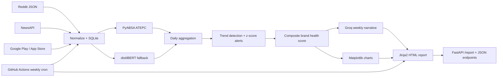
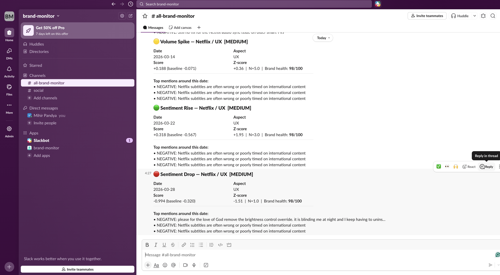
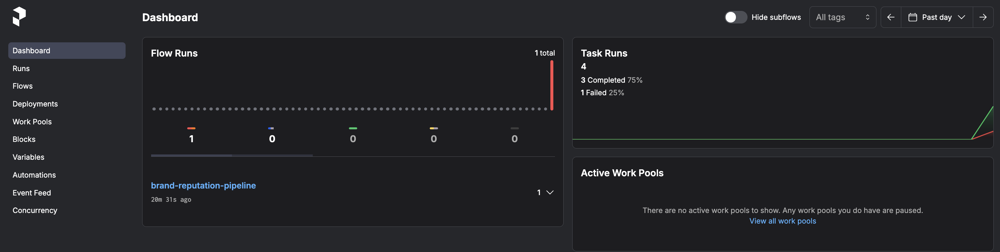

# Multi-Source Brand Reputation Intelligence Pipeline

An end-to-end brand intelligence system that ingests mentions from multiple
sources, runs aspect-level sentiment analysis, computes trend-aware brand
health, triggers alerts, generates LLM weekly reports, and serves outputs via
FastAPI. A GitHub Actions workflow runs the full pipeline weekly and commits
fresh data/report artifacts.


---

## What it does

```text
Reddit (JSON) --|                         |--> PyABSA ATEPC (aspect sentiment)
NewsAPI        --|--> Normalize --> SQLite-|--> distilBERT fallback (overall)
Google Play    --|                         |--> Evaluation + model card
```

- Scrapes brand mentions across 3 sources with no manual intervention
- Normalizes text (HTML, URLs, emoji, unicode) into a clean unified schema
- Deduplicates using MD5 hashing — idempotent across repeated runs
- Two-stage NLP: aspect-level sentiment + overall sentiment fallback
- 100% mention coverage across 722 records
- Evaluated against two independent ground truth datasets

**Current dataset (Netflix):** 748 clean records — 94% normalization yield — 0 duplicates

---

## Architecture



---

## Project structure

```text
brand-reputation-pipeline/
|- scrapers/
|  |- reddit_scraper.py    # Reddit JSON endpoint scraper
|  |- news_scraper.py      # NewsAPI scraper with pagination
|  |- review_scraper.py    # Google Play review scraper
|  |- normalizer.py        # Text cleaning and quality filtering
|- nlp/                    # Week 2 - sentiment analysis
||  |- sentiment_engine.py  # PyABSA ATEPC + distilBERT fallback
||  |- taxonomy.py          # Aspect taxonomy (5 categories)
||  |- evaluator.py         # Model evaluation + model card generation
||  |- model_card.md        # Full evaluation methodology and results
||  |- metrics.json         # Raw metrics for downstream use
||  |- manual_labels.csv    # 100 hand-labelled Reddit + news records
|- analytics/              # Week 3 - aggregation, trends, scoring, alerts
|- reports/                # Week 4 - Groq report generation + templating
|- api/                    # Week 4 - FastAPI report server
|- pipeline/               # Prefect DAG orchestration (8 stages)
|- .github/workflows/      # Weekly GitHub Actions automation
|- scripts/                # Helper scripts
|- database.py             # SQLite schema, upsert, stats
|- config.py               # Brand config and API keys (uses .env)
|- run_week1.py            # Master pipeline runner
|- requirements.txt
```

---

## Quickstart

### 1. Clone and set up environment

```bash
git clone https://github.com/yourusername/brand-reputation-pipeline  # <- edit this
cd brand-reputation-pipeline
python -m venv venv
source venv/bin/activate       # Windows: venv\Scripts\activate
pip install -r requirements.txt
```

### 2. Set up environment variables

```bash
cp .env.example .env
```

Edit `.env` and add your API keys.

### 3. Run the pipeline

```bash
python run_week1.py
```

Expected output:

```text
============================================================
Week 1 Master Pipeline | Brand: Netflix
Raw input counts:
Reddit:  400
News:     97
Reviews: 300
Combined:797
Normalization complete: kept 748, dropped 49
Insert complete: 748 records in DB
```

---

## Data sources

| Source | Method | Records | Notes |
|--------|--------|---------|-------|
| Reddit | Public `.json` endpoints - no credentials needed | 400 | Self-service API deprecated Nov 2025; using JSON trick |
| NewsAPI | Official API - free tier | 97 | Free tier caps at 100 results/day |
| Google Play | `google-play-scraper` library | 251 | Star ratings preserved as ground truth |

---

## API keys needed

| Key | Where to get it | Required |
|-----|----------------|----------|
| `NEWS_API_KEY` | newsapi.org - free signup | Yes |
| `REDDIT_USER_AGENT` | Any string - no credentials needed | Yes (just set it) |

---

## Key engineering decisions

**Unified schema across all sources** - every scraper outputs the same
7-field dict (`id`, `source`, `source_detail`, `timestamp`, `text`,
`score`, `mention_type`). Adding a new source requires zero changes
to the normalizer or database layer.

**Idempotent pipeline** - upsert logic means re-running the pipeline
never creates duplicates. Safe to schedule as a cron job.

**Graceful API degradation** - handles Reddit credential deprecation
(JSON endpoint fallback), NewsAPI plan limits (426 handling), and
App Store library failures (documented in code).

**Separation of raw and normalized text** - original text preserved
in `text` column; cleaned version in `normalized_text`. Downstream
models use normalized, but original is available for display.

---

## Slack alert example



---

## Prefect orchestration

The full pipeline runs as a Prefect DAG with 8 tasks chained sequentially with retry logic and task-level resilience.



The dashboard above shows the **retry resilience test**: `aggregate-daily` raised a deliberate `ValueError`, retried twice (30s apart), then failed — and the 3 downstream tasks never ran. This is the production-safe behavior for a scheduled pipeline.

| Task | Retries | Notes |
|---|---|---|
| `ingest-data` | 2 | Cached 6h — skips re-scrape within same day |
| `normalize-and-store` | 2 | |
| `run-sentiment-analysis` | 1 | 1hr timeout for NLP batch inference |
| `aggregate-daily` | 2 | |
| `detect-trends` | 2 | |
| `compute-health-score` | 2 | |
| `fire-alerts` | 1 | Deduplication — safe to retry |
| `generate-report` | 1 | Groq narrative + charted HTML report |

Weekly deployment registered: `brand-reputation-pipeline/weekly-brand-monitor`

---

## Weekly automation (GitHub Actions)

`Weekly Brand Pipeline` runs on:
- `schedule`: every Sunday at 06:00 UTC
- `workflow_dispatch`: manual trigger from GitHub Actions UI

Workflow behavior:
- caches PyABSA and HuggingFace model directories for faster reruns
- executes full Prefect pipeline
- commits updated `data/brand_mentions.db` and `outputs/*.html` back to `main`

---

## Model performance

| Evaluation set | N | Accuracy |
|---|---|---|
| Google Play reviews (automated, star-rating ground truth) | 189 | 83.1% |
| Reddit + news (manual labels) | 100 | 70.0% |

High-confidence predictions (> 0.90) achieve **91.6% accuracy**.
Aspect-specific predictions (UX, quality, price) reach **87–100%** on Reddit text.

Full methodology, per-class metrics, and limitations in [nlp/model_card.md](nlp/model_card.md).

---

## Roadmap

- [x] Week 1 — Multi-source data ingestion pipeline
- [x] Week 2 — Aspect-based sentiment analysis (PyABSA + distilBERT)
- [x] Week 3 — Trend detection, alerting, and Prefect orchestration
- [x] Week 4 — Groq LLM report generation, FastAPI server, Render/GitHub Actions deployment

---

## Tech stack

Python · SQLite · sqlite-utils · requests · newsapi-python ·
google-play-scraper · python-dotenv · PyABSA · Hugging Face Transformers ·
distilBERT · scikit-learn · Pandas · rapidfuzz · Prefect 3 · FastAPI ·
Jinja2 · Matplotlib · Groq API · Slack Webhooks · GitHub Actions

---

## Author

Mihir Pandya  <- edit this
([LinkedIn](https://www.linkedin.com/in/pandyamihir/))  <- edit this
